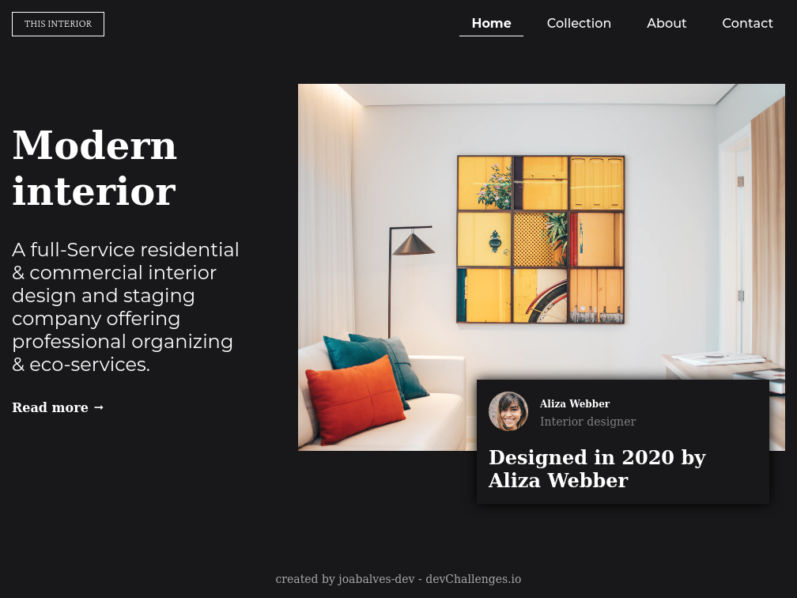
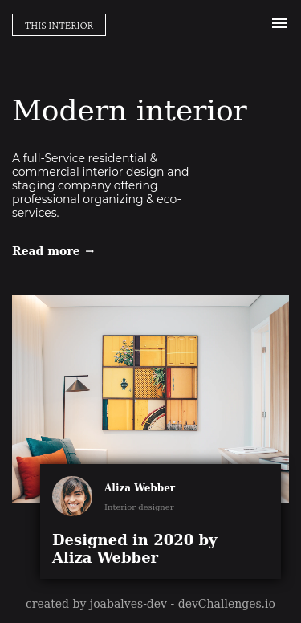

<!-- Please update value in the {}  -->

<h1 align="center">Interior-consultant</h1>

   Solution for a challenge from  <a href="http://devchallenges.io" target="_blank">Devchallenges.io</a>.

  <h3>
    <a href="https://devs.natal.br/interior-consultant-master">
      Demo
    </a>
     | 
    <a href="https://github.com/joabalves-dev/interior-consultant-master">
      Solution
    </a>
     | 
    <a href="https://devchallenges.io/challenges/Jymh2b2FyebRTUljkNcb">
      Challenge
    </a>
  </h3>

## Desktop

## Mobile design

Introduce your projects by taking a screenshot or a gif. Try to tell visitors a story about your project by answering:

- Where can I see your demo?
- What was your experience?
- What have you learned/improved?
- Your wisdom? :)

## Contact

- Website [https://devs.natal.br](https://devs.natal.br)
- GitHub [joabalves-dev](https://github.com/joabalves-dev)

